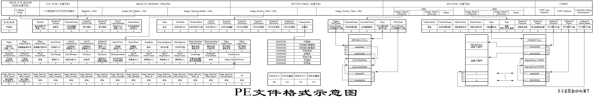

# PEple

---

A library to analyze/modify PE structure of an executable.

Finished:

✔ Analyze DOS Header

✔ Analyze PE File Header

✔ Analyze PE Optional Header

✔ Analyze Section Tables

✔ Can enable/disable Dllcharacteristic (disable Dynamic Base, disable checksum and etc...)

Pending:

✖Inject Code

✖Hook

