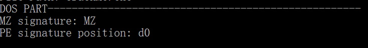
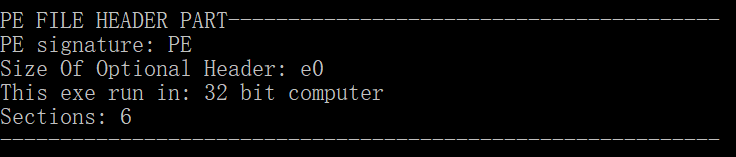
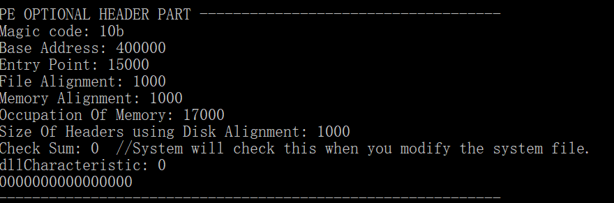
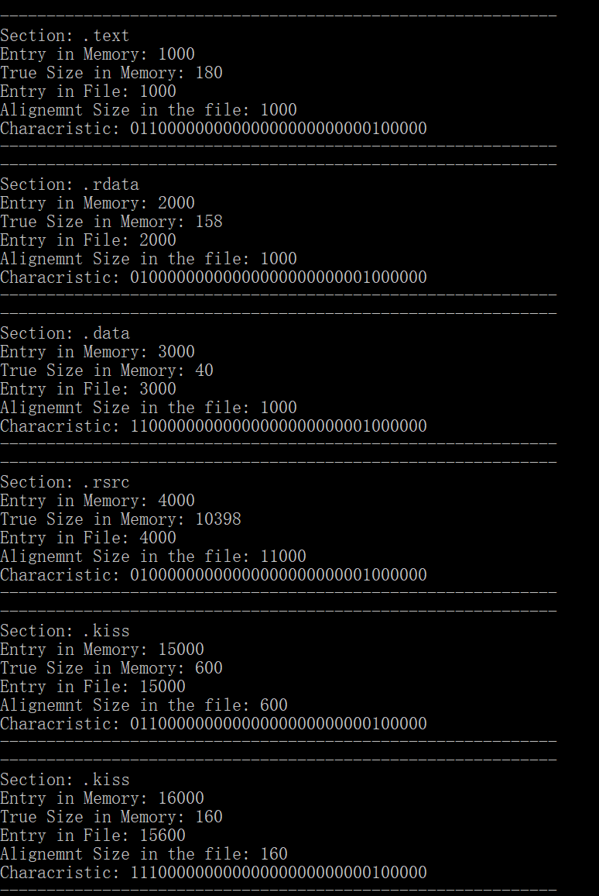
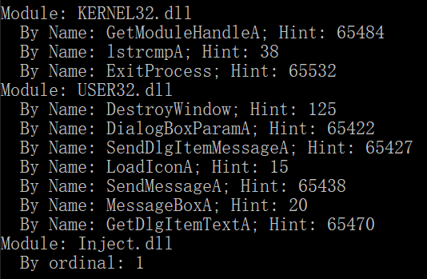
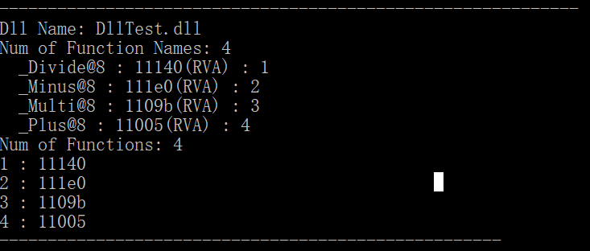
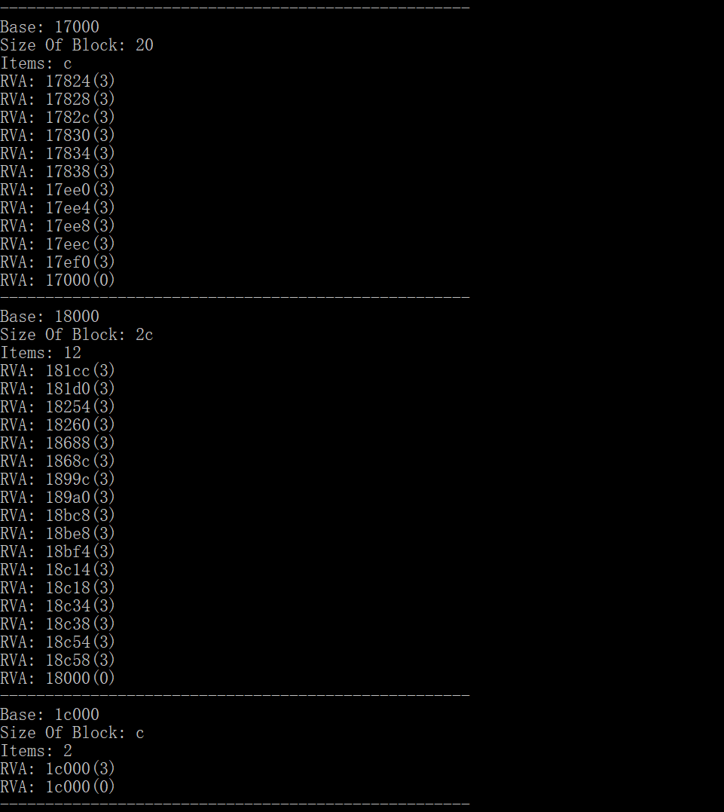
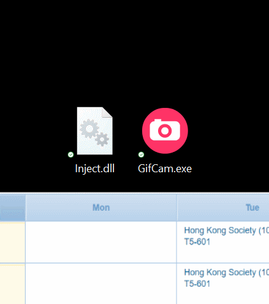

# PEple

✔ Analyze DOS Header (解析DOS头)

✔ Analyze PE File Header (解析PE File头)

✔ Analyze PE Optional Header (解析PE Optional头)

✔ Analyze Section Tables (解析节表)

✔ getImportDescriptors 获取导出表

✔ Get Export Table:

✔ Get Base Relocate Table (获取Base Relocate表)

✔ Import Descriptor Dll Injection: 构造导入表注入dll

✔ Enable/Disable DllCharacteristic (you can disable/enable Program Dynamic Base, checksum and more...) （修改软件DllCharacteristic设置: 关闭/打开动态基址，checksum检测等...）

✔ Enable/Disable Section Characteristic (enable/disable writbale, readable, .....) (设置块属性，比如设置可读可写等等)

✔ FOA to RVA (文件相对位置转换内存相对地址)

✔ RVA to FOA （内存相对位置转换文件相对位置）

✔ 32 bit Code Injection in blank space (32位空白区注入)

✔ Expend section area (扩展节的大小)

✔ Add our own section (添加自己的节)

✔ Combine all sections into one（use it when File Alignment = Memory Alignment） (合并所有节为1个节, 内存对齐和文件对齐相同的时候使用)

✔ Move Export Tables to our own new section, auto modify RVA (移动导出表到自己创建的新section中(自动修改导出表入口，FNT入口，FOT入口，FAT入口，自动将Name放到自创的Section中，自动修复FNT))

✔ Move Relocation tables to our own new section, auto modify RVA (重定位表放到自己创建的section中，并且自动修改重定位表入口)

✔ Customize Base Image (Auto fix address in base relocation table): 自定义dll文件的入口，自动修复重定位表里面的地址。
